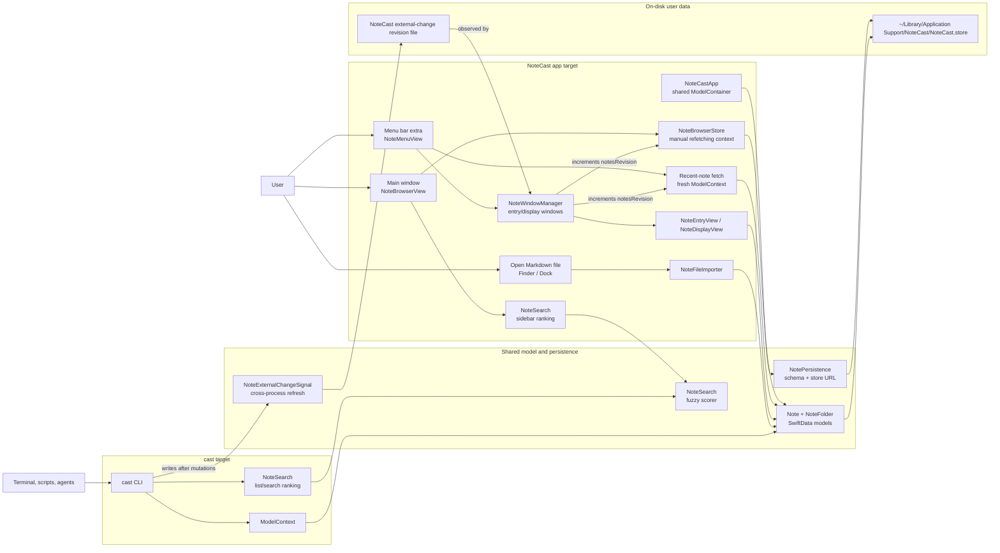

# NoteCast

NoteCast is a macOS Markdown notes app with a full notes window, a fast menu bar companion, and a scriptable `cast` command-line tool.

## Video

https://github.com/user-attachments/assets/8b471507-fd8c-49c3-83b3-82946cdda25f

## Features

- Normal macOS app window with a left sidebar and large note editor.
- Menu bar extra for quick capture, recent notes, and Start at Login control.
- Folder support backed by SwiftData.
- Drag notes onto folders, or onto **Unfiled** to remove them from a folder.
- Markdown-friendly plain-text editor with `Cmd+S` save in the main window.
- In-place Markdown preview powered by Swift Markdown and rendered in a WebKit view.
- Basic fuzzy note search in the sidebar and through the `cast` CLI.
- Compact quick-note window from the menu bar with `Cmd+Return` save.
- Shared persistent store for the app and CLI.
- Bundled `cast` CLI for terminal, scripts, pipes, and coding agents.
- Bundled Agent Skills helper so agents can discover safe `cast` workflows from the app package.

## Architecture and data flow



The app and CLI deliberately meet at the shared SwiftData layer. App windows and
the `cast` process create their own `ModelContext`s, but they all use
`NotePersistence` to open the same schema and store. App-side changes increment
`NoteWindowManager.notesRevision`; CLI changes publish `NoteExternalChangeSignal`
so the running app can refresh the main browser and menu bar recent-note list.

## Main app workflow

1. Launch NoteCast from Xcode or Finder.
2. Use the sidebar to select **All Notes**, **Unfiled**, a folder, or an individual note.
3. Click **New Note** to create a note in the selected folder context.
4. Click **New Folder** to organize notes.
5. Drag note rows/cards onto folders to move them.
6. Edit title/body/folder in the main note pane and press `Cmd+S` or click **Save**.
7. Right-click a note row or note card for note-level actions such as **Copy Markdown** and **Delete Note**.

The menu bar extra remains available while the full app is running. Use it for quick notes, recent-note access, or reopening the main NoteCast window.

## CLI quick start

The app embeds the CLI and its Agent Skills helper at:

```text
NoteCast.app/Contents/Resources/bin/cast
NoteCast.app/Contents/Resources/skills/notecast-cast/SKILL.md
```

Install a convenient shell command:

```bash
ln -sf "/Applications/NoteCast.app/Contents/Resources/bin/cast" /usr/local/bin/cast
```

Examples:

```bash
cast add --title "Release idea" "Ship folder drag and drop"
ls -1 | cast                         # quick command-output capture, saved as a Markdown code block
echo "Piped markdown" | cast add --json  # exact piped body for scripts/agents
cast list --json
cast search "relese noets" --json       # fuzzy/ranked search
cast read NOTE_ID --raw
cast update NOTE_ID --title "Better title" "Updated body"
cast delete NOTE_ID --json
cast path
```

`cast search TEXT` and `cast list --query TEXT` use the same lightweight fuzzy
ranking as the app sidebar search. They search note titles, folder names, note
bodies, ids, MIME types, and creation source metadata, with title matches ranked
highest. The matcher handles exact matches, word prefixes, small typos, acronyms,
and subsequence-style matches. It is intentionally app-side search over the
SwiftData notes, not SQLite FTS.

## Agent skill installation

This repository includes an Agent Skills-compatible helper at `skills/notecast-cast/` so coding agents know how to use the `cast` CLI safely. App builds also package the same skill at:

```text
/Applications/NoteCast.app/Contents/Resources/skills/notecast-cast
```

Install it by symlinking or copying the packaged skill into your agent's skills directory:

```bash
APP_SKILL="/Applications/NoteCast.app/Contents/Resources/skills/notecast-cast"
mkdir -p ~/.codex/skills ~/.claude/skills ~/.pi/agent/skills
ln -sfn "$APP_SKILL" ~/.codex/skills/notecast-cast   # Codex
ln -sfn "$APP_SKILL" ~/.claude/skills/notecast-cast   # Claude
ln -sfn "$APP_SKILL" ~/.pi/agent/skills/notecast-cast # Pi
```

When developing from a checkout, you can link the source copy instead:

```bash
ln -sfn "$PWD/skills/notecast-cast" ~/.codex/skills/notecast-cast
```

Restart the agent after installing. The skill expects either `cast` to be on `PATH` or the bundled command to exist at `/Applications/NoteCast.app/Contents/Resources/bin/cast`.

### Using the skill in an agent harness

After restarting the agent, either ask for a NoteCast-related task naturally or name the skill explicitly in the prompt.

Example:

```text
Create a note listing your three favorite scripting languages. For each one, add a brief explanation of why you like it.
```

Other useful prompts:

```text
Use NoteCast to remember this decision: keep the CLI JSON output stable for scripts.
List my 10 most recent NoteCast notes.
Search my NoteCast notes for release decisions.
Read the NoteCast note with id NOTE_ID.
Update NOTE_ID with this new Markdown body: ...
```

## Markdown preview

The main editor defaults to **Preview** mode. Use the compact Preview/Edit segmented control in the window titlebar, the **Editor** menu, `Cmd+1` for Preview, or `Cmd+2` for Edit to switch between rendered HTML and Markdown source editing. `Cmd+0` toggles the sidebar. Preview mode parses the current Markdown with Apple's Swift Markdown package, generates HTML, and displays it inside the existing editor pane using `WKWebView`. The default preview stylesheet is vendored from `github-markdown-css` at `NoteCast/Preview/github-markdown.css`, with a small NoteCast wrapper for readable width and app integration. It does not open a separate preview window.

## Data location

NoteCast intentionally uses one shared SwiftData store for the app and CLI:

```text
~/Library/Application Support/NoteCast/NoteCast.store
```

## Build

```bash
xcodebuild -project NoteCast.xcodeproj -scheme NoteCast -configuration Debug build
xcodebuild -project NoteCast.xcodeproj -scheme cast -configuration Debug build
```

Building the `NoteCast` scheme packages both `Contents/Resources/bin/cast` and `Contents/Resources/skills/notecast-cast` into the app bundle.

Run tests:

```bash
xcodebuild test -project NoteCast.xcodeproj -scheme NoteCast -configuration Debug -destination 'platform=macOS,arch=arm64'
```

## Project layout

The Xcode project uses file-system-synchronized groups, so these logical folders
are real folders on disk and are mirrored in Xcode's project navigator.

| Path | Purpose |
| --- | --- |
| `NoteCast/App/NoteCastApp.swift` | App entry point, normal main window, menu bar extra, app delegate, open-file handling, and app-wide commands. |
| `NoteCast/Browser/NoteBrowserView.swift` | Main browser composition: split view, toolbar, folder sheet, command palette presentation, and note/folder actions. |
| `NoteCast/Browser/NoteBrowserStore.swift` | Main-window view model and SwiftData context owner; reloads notes/folders and preserves selection across refetches. |
| `NoteCast/Browser/NoteBrowserSidebar.swift` | Sidebar collections, folder rows, note rows, search field, and drag/drop targets. |
| `NoteCast/Browser/NoteBrowserDetail.swift` | Right-side detail area for the selected note or collection landing view. |
| `NoteCast/Browser/NoteBrowserEditorView.swift` | Title/body/folder editor, preview/edit state, Save/Revert controls, and preview color-scheme control. |
| `NoteCast/Browser/NoteBrowserEditorCommandBridge.swift` | Focused command bridge that exposes editor Save/Revert state to menu commands and the palette. |
| `NoteCast/Browser/NoteBrowserNoteActions.swift` | Shared note context-menu actions such as Copy Markdown, Copy ID, and Delete. |
| `NoteCast/Browser/FolderNameSheet.swift` | Create/rename folder sheet. |
| `NoteCast/CommandPalette/CommandPaletteModels.swift` | Testable command palette models, command metadata, and search/ranking logic. |
| `NoteCast/CommandPalette/CommandPaletteView.swift` | Keyboard-first command palette UI. |
| `NoteCast/MenuBar/NoteMenuView.swift` | Menu bar menu contents, quick-note entry point, recent-note refresh, Start at Login toggle, and Quit command. |
| `NoteCast/MenuBar/NoteWindowManager.swift` | AppKit utility-window owner for quick entry, display windows, UI-test harness, notifications, and external refresh monitoring. |
| `NoteCast/MenuBar/NoteEntryView.swift` | Compact create/edit note window with `Cmd+Return` save. |
| `NoteCast/MenuBar/NoteDisplayView.swift` | Compact read-only note window with Copy/Edit/Delete actions. |
| `NoteCast/MenuBar/LaunchAtLoginController.swift` | ServiceManagement wrapper for the Start at Login setting. |
| `NoteCast/Preview/MarkdownPreview.swift` | Swift Markdown to HTML conversion and WebKit preview view. |
| `NoteCast/Preview/github-markdown.css` | Vendored GitHub Markdown CSS used by the in-place preview. |
| `NoteCast/Services/NoteFileImporter.swift` | Markdown file import service used when files are opened from Finder or the Dock. |
| `NoteCast/Services/NoteNotificationController.swift` | User notification scheduling for newly created or imported notes. |
| `NoteCast/TestingSupport/UITestingSupport.swift` | Test-only launch flags, seed data, and isolated-store helpers. |
| `NoteCast/TestingSupport/UITestHarnessView.swift` | Test-only window that mounts compact views for UI automation. |
| `NoteCast/Assets.xcassets` | Accent color and app icon asset catalog. |
| `NoteCast/icon.icon` | Alternate icon asset source referenced by the app build settings. |
| `NoteCast/Info.plist` | App metadata, bundle settings, and Markdown document type registration. |
| `Shared/Models/Note.swift` | SwiftData note model, display helpers, title generation, and migration repair. |
| `Shared/Models/NoteFolder.swift` | SwiftData folder model and inverse relationship to notes. |
| `Shared/Persistence/NotePersistence.swift` | Shared SwiftData schema, store URL, test-store handling, and `ModelContainer` setup. |
| `Shared/Persistence/NoteExternalChangeSignal.swift` | Distributed notification and revision-file signal used when `cast` mutates the shared store. |
| `Shared/Search/NoteSearch.swift` | Shared fuzzy note search scorer used by the app sidebar and CLI. |
| `Cast/main.swift` | `cast` command parser and command implementations. |
| `Cast/CastSupport.swift` | CLI terminal, JSON, error, date, and Markdown-fence helpers. |
| `NoteCastTests/` | Unit tests for shared logic, importer behavior, browser store behavior, and command palette ranking. |
| `NoteCastUITests/` | End-to-end UI tests for the compact windows, main browser, and command palette. |
| `skills/notecast-cast/SKILL.md` | Agent-facing guide for safe `cast` CLI workflows. |
